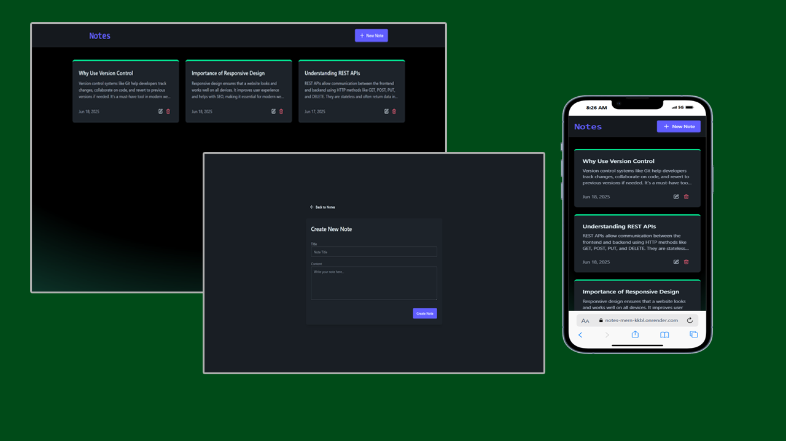

# 📝 Note MERN App
---

## 📑 Table of Contents

- [Overview](#overview)
  - [Screenshot](#screenshot)
  - [Links](#links)
- [Login Credentials](#login-credentials)
- [My Process](#my-process)
  - [Built With](#built-with)
  - [What I Learned](#what-i-learned)

---

## 📖 Overview
**Note MERN** is a full-stack note-taking web application built with the **MERN stack** (MongoDB, Express.js, React.js, Node.js). It allows users to:

- ✍️ Create new notes
- 🛠️ Update existing notes
- 🗑️ Delete notes

### 🖼️ Screenshot

### 🔗 Links

- 🚀 **Live Site**: [View Project](https://notes-mern-kkbl.onrender.com/)  
  ⚠️ *Please note: The live site may take **20–30 seconds to load** on first visit due to Render.com's free hosting cold start limitations.*
  
- 📂 **Repository**: [GitHub Repo](https://github.com/Ramelzkie96/Notes-Mern)

---

## 🔧 My Process

### 🛠️ Built With

- 🟢 **MongoDB** – NoSQL database for storing notes
- ⚙️ **Express.js** – Backend framework for building RESTful APIs
- 🔵 **React.js** – Frontend library for building user interfaces
- 🟡 **Node.js** – JavaScript runtime for server-side logic
- 🎨 **Tailwind CSS** – Utility-first CSS framework for fast UI styling
- 🌼 **DaisyUI** – Tailwind CSS component library for clean and accessible UI
- 🟥 **Upstash Redis** – Serverless Redis used for API rate limiting
- ☁️ **Render.com** – Cloud hosting platform used to deploy backend and frontend

### ✨ Features

- 📝 **Create Notes** – Easily add new notes with a title and content.
- 🛠️ **Edit Notes** – Update existing notes with real-time changes.
- 🗑️ **Delete Notes with Confirmation** – Delete notes permanently with a confirmation prompt to prevent accidental deletions.
- 🚦 **Rate Limiting with Upstash** – Prevents abuse by limiting how many requests a user can make in a short period.
- ⏳ **Loading Indicators** – Smooth user experience with visual feedback during data fetch and processing.
- 💡 **Responsive UI** – Clean and mobile-friendly interface built with Tailwind CSS and DaisyUI.
- ☁️ **Deployed on Render.com** – Full-stack deployment using free cloud hosting (note: initial load may take 20–30 seconds due to cold starts).

### 📚 What I Learned

- 🔄 How to build a full-stack CRUD application using the **MERN stack (MongoDB, Express, React, Node.js)**.
- 🚦 Implemented **rate limiting** with **Upstash Redis** to prevent abuse from excessive requests.
- ⚙️ Gained experience in setting up **middleware** for backend request control.
- 🧠 Understood the challenges of **free hosting cold starts** and how services like **Render.com** work.
- 🎨 Enhanced my UI/UX skills by integrating **Tailwind CSS** and **DaisyUI** for clean, responsive design.
- ⏳ Improved user experience with **loading states** and **delete confirmation prompts** to avoid accidental data loss.
- 🌐 Deployed a full-stack app and debugged common issues in a live production environment.
---

### 🙏 Credits

This project was created by following a helpful YouTube tutorial by **Codesistency**. It served as a great learning experience for building a full-stack MERN application with added features like rate limiting and UI enhancements.

- 📺 **Tutorial Link**: [MERN Stack Note App with Rate Limiting](https://youtu.be/Ea9rrRj9e0Y?si=KaDjpLOgwkckldIG) by **Codesistency**

💡 Feel free to contribute or fork the project to enhance it with a backend or more features!
